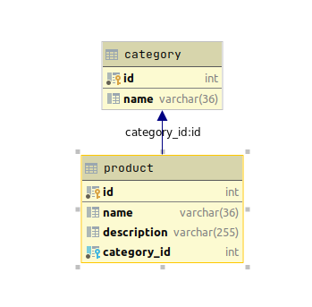

# POC RESULTS
=============

### Database schema


### EAGER
If the association is marked as EAGER, it will fetch and load the associated entity as well.

### LAZY
If the association is marked as LAZY, doctrine will create proxy objects in place of the actual entity.
During first call to that associated entity, doctrine will fetch and load that object(s) from database.
Associations are marked as LAZY by default.

### EXTRA_LAZY
If the association is marked as EXTRA LAZY the methods based on collections can be called without triggering a full load of the collection.
Example methods: contains(), containsKey(), count(), get(), slice().

## Fetch associated object

### EAGER
$productRepository = $entityManager->getRepository(Product::class);
$product = $productRepository->find(1);

```sql
SELECT
    t0.name AS name_1,
    t0.description AS description_2,
    t0.id AS id_3,
    t0.category_id AS category_id_4,
    t5.name AS name_6,
    t5.id AS id_7
FROM product t0
LEFT JOIN category t5 ON t0.category_id = t5.id WHERE t0.id = ?
```

### LAZY
$productRepository = $entityManager->getRepository(Product::class);
$product = $productRepository->find(1);

```sql
SELECT
    t0.name AS name_1,
    t0.description AS description_2,
    t0.id AS id_3,
    t0.category_id AS category_id_4
FROM product t0 WHERE t0.id = ?
```

## Fetch associated collection

### EAGER
$categoryRepository = $entityManager->getRepository(Category::class);
$category = $categoryRepository->find(1);
$product = $category->getProducts()->count();

```sql
SELECT
    t0.name AS name_1,
    t0.id AS id_2,
    t3.name AS name_4,
    t3.description AS description_5,
    t3.id AS id_6,
    t3.category_id AS category_id_7
FROM category t0 LEFT JOIN product t3 ON t3.category_id = t0.id WHERE t0.id = ?
```

### LAZY
$categoryRepository = $entityManager->getRepository(Category::class);
$category = $categoryRepository->find(1);
$product = $category->getProducts()->count();

```sql
SELECT t0.name AS name_1, t0.id AS id_2 FROM category t0 WHERE t0.id = ?
```
```sql
SELECT
    t0.name AS name_1,
    t0.description AS description_2,
    t0.id AS id_3,
    t0.category_id AS category_id_4,
    t5.name AS name_6,
    t5.id AS id_7
FROM product t0 LEFT JOIN category t5 ON t0.category_id = t5.id WHERE t0.category_id = ?
```

### EXTRA_LAZY
$categoryRepository = $entityManager->getRepository(Category::class);
$category = $categoryRepository->find(1);
$product = $category->getProducts()->count();

```sql
SELECT t0.name AS name_1, t0.id AS id_2 FROM category t0 WHERE t0.id = ?
```
```sql
SELECT COUNT(*) FROM product t0 WHERE t0.category_id = ?
```
